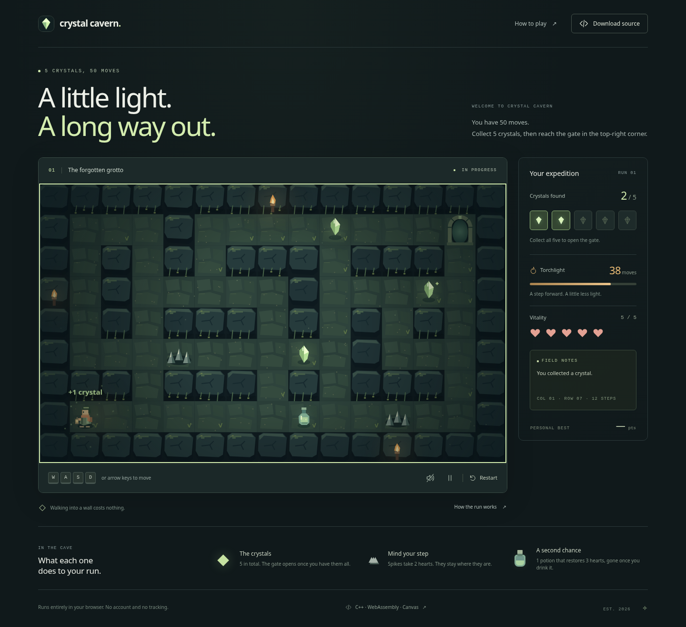
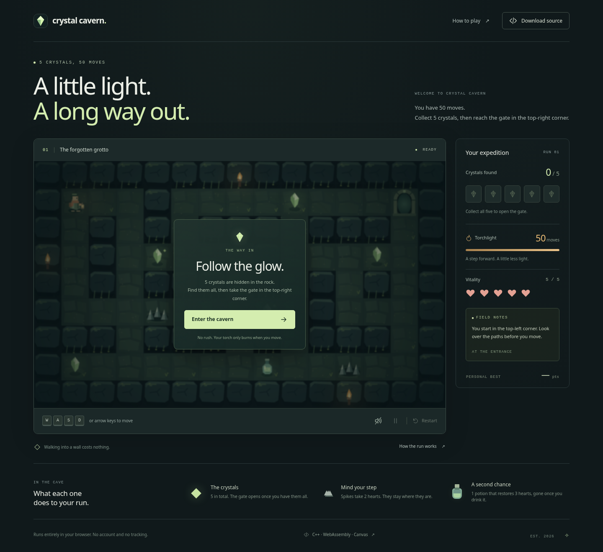
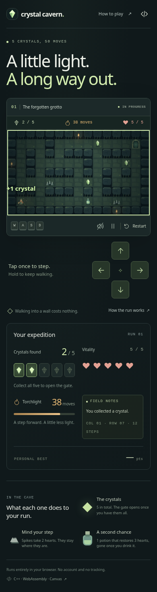

<div align="center">

# Crystal Cavern

**A little light. A long way out.**

Five crystals, fifty moves, one gate. Every step costs a turn of torchlight, so
planning beats exploring.

**C++17 · WebAssembly · Canvas 2D · Web Audio · No runtime dependencies**

[](https://github.com/0xABCD01/crystal-cavern/actions/workflows/ci.yml)


[Play locally](#play-in-one-command) · [How it works](#under-the-surface) · [Publish to GitHub Pages](#publish-to-github-pages) · [Generation prompt](PROMPT.md)

</div>



<details>
<summary>Start screen and mobile layout</summary>


</details>

The cave animates in real time, but the game is turn based: your torch only burns
when you move. A full run takes a few minutes.

## Play in one command

From this directory, with Python 3 and Make installed:

```sh
make serve
```

Open **http://localhost:8080**. The compiled WebAssembly engine is included, so
playing does **not** require Emscripten, Node.js, npm, or a C++ compiler.

If port 8080 is busy:

```sh
make serve PORT=8765
```

Without Make, including on Windows:

```sh
python3 scripts/package_source.py
python3 -m http.server 8080 --bind 127.0.0.1 --directory web
```

On Windows, use `py` instead of `python3` if that is your Python launcher. Serve
over HTTP; opening `index.html` directly with `file://` cannot load WebAssembly.

## What is in the game

- Stone corridors with moss, floating crystals, a pixel explorer, a glowing gate,
  torch flicker, and particles, all drawn in Canvas without image assets.
- Arrow keys and WASD, plus a touch pad and a compact status bar on mobile.
- A 50-move torch, five hearts, reusable spike traps, and one healing potion.
- Start, pause, guide, restart confirmation, victory, loss, and replay screens.
- Synthesized sound effects with a mute toggle. Audio starts after your first
  interaction, because browsers require it.
- Personal best and sound preference saved locally. Blocked storage does not
  prevent play. There is no account, analytics, backend, or external font.
- Reduced-motion support, keyboard-operable buttons, managed dialog focus, and
  text status updates for screen readers.

### Controls and rules

| Control | Action |
| --- | --- |
| Arrow keys / W A S D | Move immediately; no Enter key |
| Touch direction pad | Tap to step, hold to keep walking |
| Esc / P | Pause; Esc also closes a dialog |
| R | Restart, with confirmation during an active run |
| H | Open the explorer's guide |
| Sound button | Enable or mute effects |

Every **successful move** spends one torch turn. Walking into a wall, reading the
guide, or pausing costs nothing. Spikes remove **2 health every time** you enter.
The potion restores **up to 3**, capped at 5, and is consumed even at full
health. Collect all five crystals, then enter the gate in the top-right corner.
Reaching it on the final torch turn still wins.

Your score is **10 × remaining torch turns + 20 × remaining health**. The
handcrafted level has a verified 34-move winning route and rewards planning.

## Under the surface

```text
Keyboard / touch
      │
      ▼
web/app.js ── calls C ABI ──► src/web.cpp ──► include/game.hpp
      │                       WebAssembly    C++ game rules
      │                                            ▲
      ├── web/renderer.js → Canvas animation        │
      ├── Web Audio → synthesized effects     src/main.cpp
      └── localStorage → preferences          terminal frontend
```

**One rules engine, two frontends.** Movement, collision, item collection,
health, torch consumption, scoring, and game outcomes live only in C++.
Emscripten exposes a small C-compatible interface to JavaScript. The browser
reads a state snapshot after each input and never re-implements the rules.

Rendering runs on its own clock. `requestAnimationFrame` interpolates movement
and animates the cave. Terrain is cached in an offscreen canvas at device
resolution and copied back in that same space, so the blit is an unscaled
one-to-one copy that also erases the previous frame. Items, lighting, and
particles are drawn each frame. Light and shadows are pre-rendered into sprites
so a frame does no gradient work. The drawing buffer matches the display size
and pixel density, which keeps the artwork sharp on retina screens. With reduced
motion the scene is static, so the board repaints only when the game state
changes instead of on every animation frame.

Input has one step gate at 140 ms. A held key repeats on that gate so a leaning
finger cannot drain the torch, and a fast sequence of taps queues in order
instead of being dropped. Reduced motion removes movement interpolation,
floating objects, dust, and hit shake.

The shipped game uses one handcrafted level, no game framework, and no asset
pipeline.

```text
include/game.hpp             Shared C++17 engine
src/main.cpp                 Original terminal frontend
src/web.cpp                  WebAssembly C ABI
web/index.html               Responsive interface and semantic controls
web/style.css                Visual system and mobile layouts
web/app.js                   Browser input, UI, sound, and persistence
web/movement.mjs             Step gate shared by keyboard and touch
web/renderer.js              Original procedural Canvas artwork
web/engine.js + engine.wasm  Included Emscripten build output
scripts/package_source.py    Creates the in-game source download
scripts/make_previews.py     Regenerates the README preview screenshots
tests/game_tests.cpp          Native gameplay regression tests
tests/movement_tests.mjs      Input pacing and ordering tests
tests/browser_tests.py        Real-browser integration tests
.github/workflows/ci.yml      Native, input, and browser verification
.github/workflows/pages.yml   Manual GitHub Pages deployment
```

## Build the C++ engine

The checked-in browser build is ready to serve. Rebuild after changing C++ code.
Install [Emscripten SDK 4.0.15](https://emscripten.org/docs/getting_started/downloads.html)
using the official SDK:

```sh
git clone https://github.com/emscripten-core/emsdk.git ../emsdk
cd ../emsdk
./emsdk install 4.0.15
./emsdk activate 4.0.15
source ./emsdk_env.sh
cd ../crystal-cavern
make web
```

`make web` rebuilds `web/engine.js`, `web/engine.wasm`, and the source ZIP. Commit
both generated engine files with C++ changes so a fresh clone stays playable.
The source ZIP is generated and ignored by Git. `make serve` recreates it.
The included compiler output is marked generated in `.gitattributes`.

The browser calls exported functions from the compiled module, using
[Emscripten's documented C/JavaScript interface](https://emscripten.org/docs/porting/connecting_cpp_and_javascript/Interacting-with-code.html).

The original terminal game also remains available:

```sh
make run
# Or, without Make:
c++ -std=c++17 -O2 -Wall -Wextra -Wpedantic src/main.cpp -o crystal-cavern
./crystal-cavern
```

For MSVC, from a Visual Studio Developer Command Prompt:

```bat
cl /nologo /std:c++17 /EHsc /W4 src\main.cpp /Fe:crystal-cavern.exe
crystal-cavern.exe
```

The terminal version takes one command followed by Enter; `Q` quits.

## Tests

```sh
make test      # 12 native gameplay tests
make test-js   # 9 input pacing tests (needs Node.js)
```

The native tests cover collisions, item reuse, repeated damage, healing limits,
locked exits, both loss conditions, victory, final-turn victory, score
calculation, and full reset. Tests stay active in release builds.

The input tests cover tap ordering, held-key repeats, switching direction while
holding, clearing on pause and focus loss, slow frames, a fast sequence of taps
that must not lose a move, a queued tap outranking an aged repeat, taps that
survive releasing the held key, and the cap on a scripted flood of taps.

The browser suite starts its own HTTP server and drives Chromium:

```sh
python3 -m venv .venv
. .venv/bin/activate
python -m pip install -r tests/requirements.txt
python -m playwright install chromium
make package test-web
```

`make previews` drives Chromium the same way to refresh the screenshots in
`docs/` from the current engine, menu, and mobile layouts.

It exercises the **actual WebAssembly engine** through keyboard and button input:
winning routes, last-turn wins, both losses, pause, help, restart, saved scores,
audio settings, mobile controls, touch-pad wall bumps, a hearts-only loss
driven from the touch pad, wall-bump feedback, dialog open animations, a frozen
board under reduced motion, a one-to-one terrain blit, drawing-buffer density
handling, unavailable storage, downloads, and a failed engine load with
recovery. Set `CHROMIUM_PATH`
to use a specific Chromium executable; otherwise it uses system Chromium or
Playwright's browser.

CI builds native tests with GCC and Clang, runs address/undefined-behavior
sanitizers, runs the input tests, recompiles the WebAssembly engine, and runs the
browser suite.

## Publish to GitHub Pages

1. Create a GitHub repository and push **the contents of this directory as its
   root**, including `.github`, `web/engine.js`, and `web/engine.wasm`.
2. In **Settings → Pages → Build and deployment**, choose **GitHub Actions**.
3. Open **Actions → Deploy to GitHub Pages → Run workflow**.
4. Once deployment succeeds, add its URL to the repository's **About → Website**
   field and pin the repository to your profile.

The workflow builds from C++ source before publishing. Publishing is manual;
normal pushes and pull requests run verification. All site paths are relative,
so the game works beneath a repository URL as well as at a domain root. The
workflow follows GitHub's [custom Pages workflow documentation](https://docs.github.com/en/pages/getting-started-with-github-pages/using-custom-workflows-with-github-pages).

Suggested repository description:

> A handcrafted browser puzzle adventure: C++17 game engine compiled to WebAssembly,
> procedural Canvas artwork, responsive controls, and automated gameplay tests.

Suggested topics: `cpp17`, `webassembly`, `emscripten`, `canvas`, `game`, `gamedev`,
`github-pages`.

## License

[MIT](LICENSE). The hand-written code and procedural artwork are original to this
project. Runtime attributions are included in
[third-party notices](web/THIRD_PARTY_NOTICES.txt).
